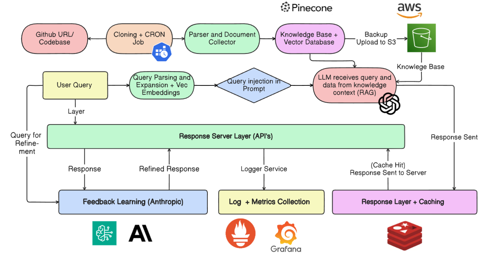
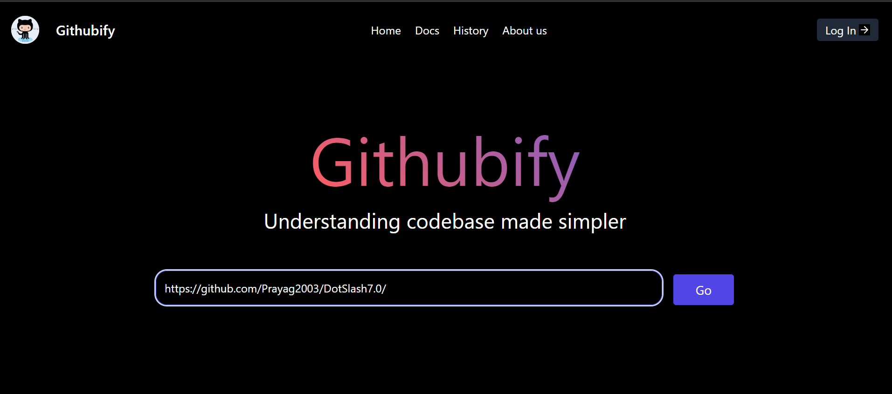
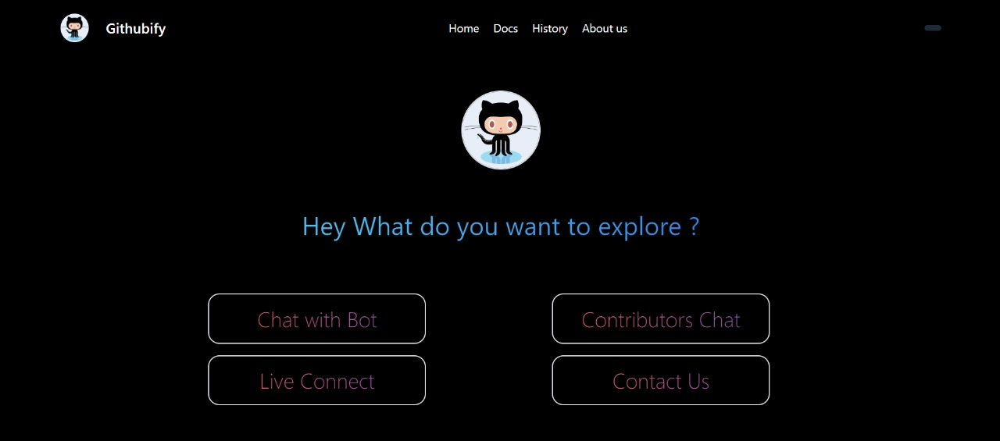
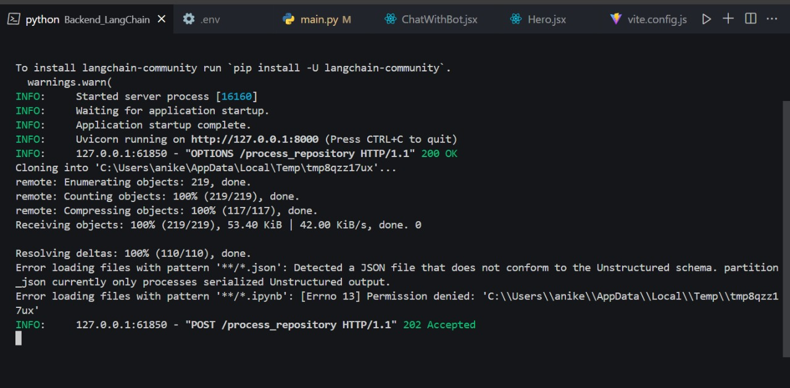
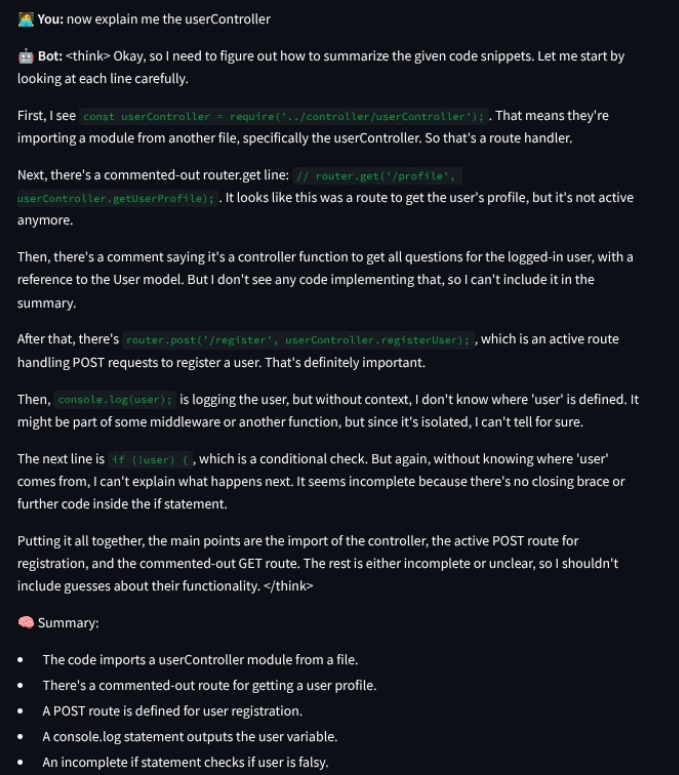
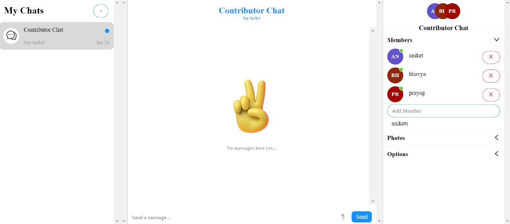
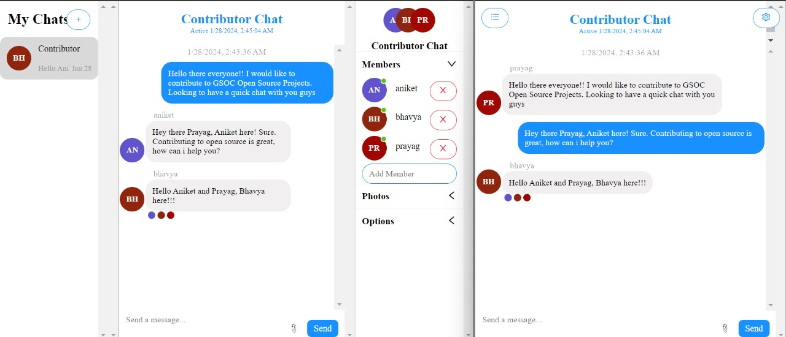

# Welcome to **Project GITHUBIFY**! 🚀
## Understanding any codebase made simpler by just few clicks and Q/A⚡⚡
## Table of Contents

- [Overview](#overview)
- [High Level System Design](#high-level-system-design)
- [Features](#features)
    - [Home Page](#home-page)
    - [Explore Section](#explore-section)
    - [Cloning Repo & Processing](#cloning-repo--processing)
    - [Advanced Chat Engine](#advanced-chat-engine)
    - [MultiUser Real-Time Chat](#multiuser-real-time-chat)
    - [Video Call](#video-call)
- [Team](#team)

---

## Overview

GITHUBIFY is a tool designed to help developers quickly understand complex codebases. With features like AI-powered chat, real-time collaboration, and video calls, it streamlines onboarding and boosts productivity.

- Chat with our bot to understand complex codebases and get a better understanding of the codebase.
- Reduces the time taken to understand codebases by 50% and increases productivity by 2x.
- Plus, senior developers can focus on more important tasks rather than explaining the codebase to the newbies.
- The bot uses Langchain API to understand the codebase, vectorize it, and then uses OpenAI API to generate responses to the user's queries.
- The bot also has a chat with fellow contributors and a video call feature.

---

## High Level System Design

---
---

## Features

### Home Page

### Explore Section

### Cloning Repo & Processing

- Utilizes [LangChain API](https://python.langchain.com/) for codebase understanding and vectorization.
- Integrates [OpenAI API](https://platform.openai.com/docs/api-reference) for generating responses.

## Sample Query

### Advanced Chat Engine

- Chat with the bot to clarify codebase concepts.
- Reduces onboarding time and increases productivity.

### MultiUser Real-Time Chat

- Collaborate with fellow contributors in real time.

### Video Call

- WebRTC-based video calls using [PeerJS](https://peerjs.com/).

## Team

**Thank you!**  
Team ETHEREUM BOTS 🤖

---
